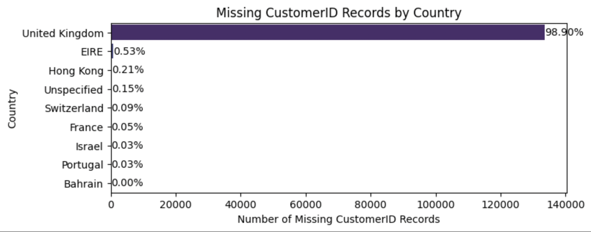
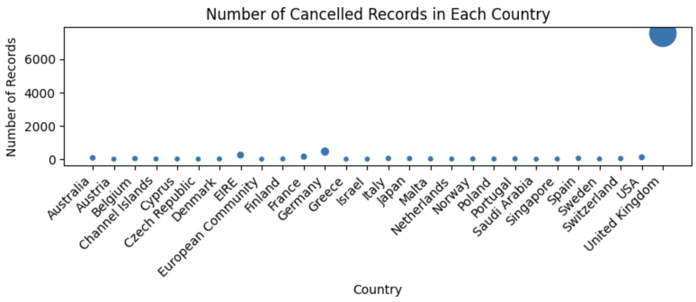
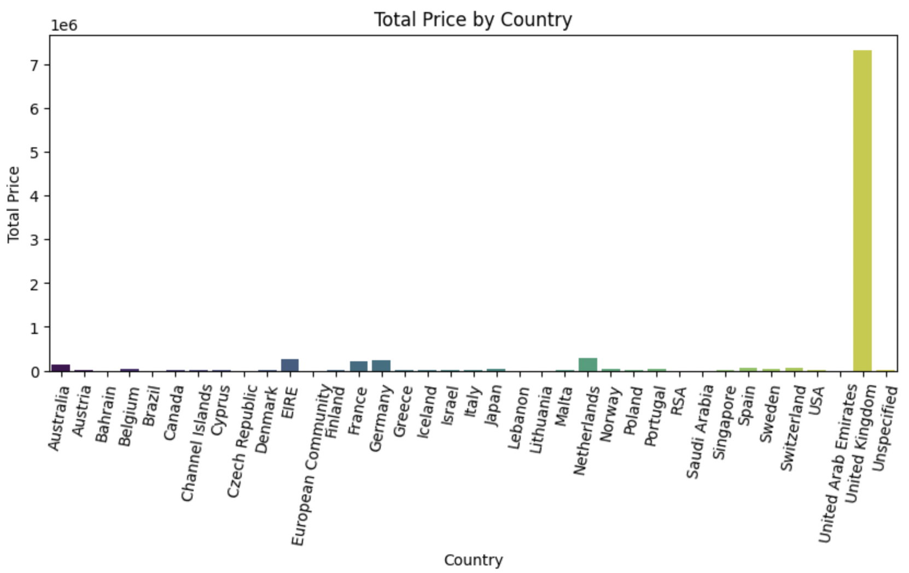
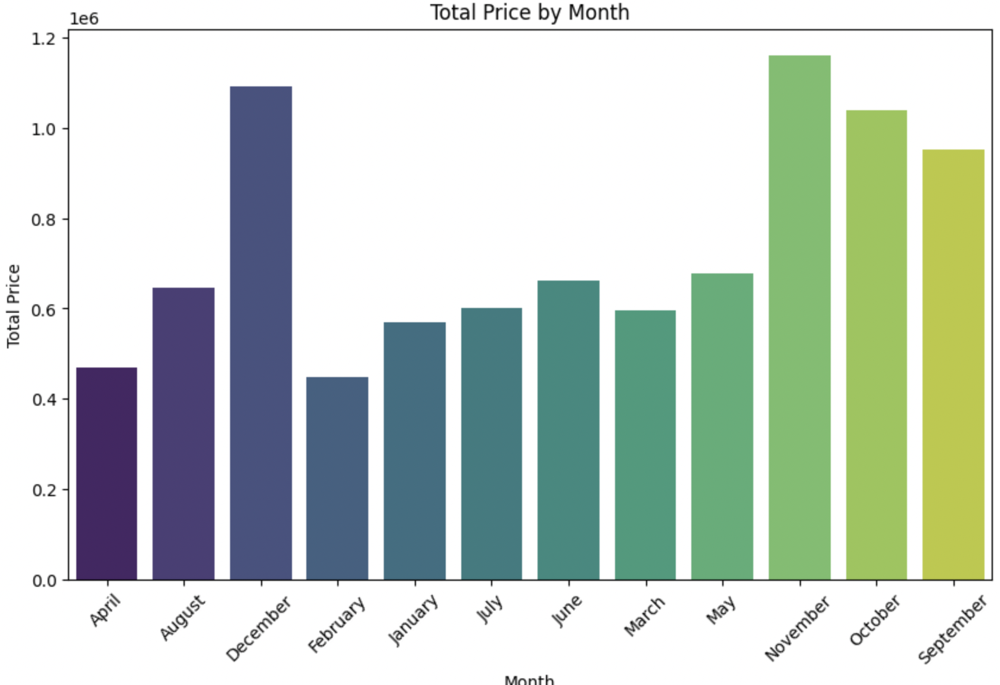
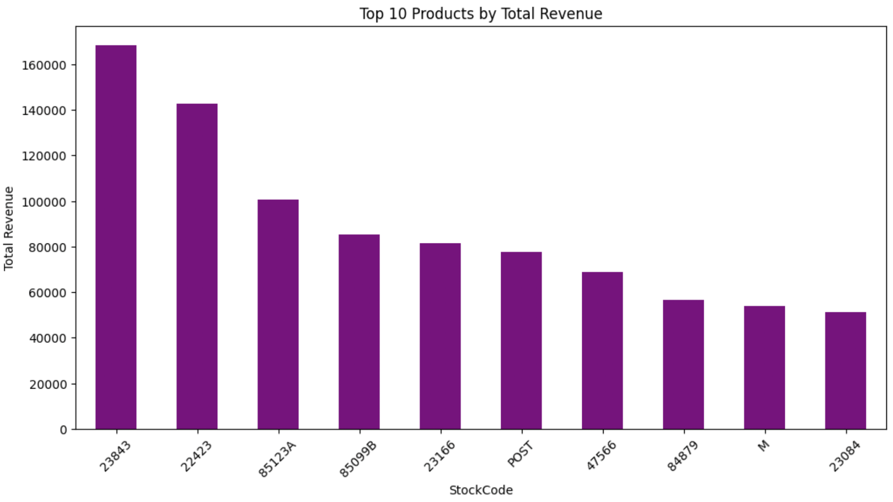

# Internship_Fusion_RetailDataAnalysis

## Documentation Report: Customer Segmentation and Sales Analysis

#### Dataset Overview:

The dataset represents transaction data from an online retail store. It includes various attributes such as InvoiceNo, StockCode, Description, Quantity, InvoiceDate, UnitPrice, CustomerID, and Country. The focus of the analysis is to segment customers based on their behavior and demographics to understand how these factors impact sales and marketing strategies.

### Scruitinising Missing data as well as Cancelled invoices.

Null values may carry important contextual information. For instance, missing values in a healthcare dataset might indicate that a patient was not tested for a particular condition, which could be a critical insight in itself.

Imbalance in Data: Removing rows with null values can lead to a loss of data that represents specific subgroups, causing an imbalance. This can skew the analysis, particularly if the null values are not randomly distributed but are instead associated with a particular class or category.

Bias Introduction: If the missing data is non-random, simply dropping these entries can introduce bias into the analysis. For example, if income data is missing more frequently for certain demographics, removing these rows could lead to underrepresentation of those groups, skewing insights and potentially leading to biased decisions.

Correlation with Other Variables: Null values might be correlated with other variables. By removing them, you might inadvertently affect the relationships and correlations in the dataset, leading to inaccurate modeling and interpretation.
Reduction in Sample Size:

Dropping rows with missing data reduces the sample size, which in turn reduces the statistical power of the analysis. This could result in less reliable results, especially in smaller datasets where every data point is valuable.

Overfitting in Models: In predictive modeling, a reduced dataset might lead to overfitting, where the model becomes too closely tailored to the limited data it has, reducing its generalizability to new data.
Missed Patterns and Anomalies:

Sometimes, patterns in missing data can reveal underlying issues or insights, such as systematic errors in data collection or specific conditions under which data is missing. By dropping null values, you miss the opportunity to explore these patterns and address potential systemic issues.
Anomalies and Outliers: Missing values might be associated with anomalies or outliers that could provide critical insights. For example, a null value in sales data could be linked to an external factor, such as a supply chain disruption, that merits investigation.

### ***Observations on the Missing CustomerID Records by Country***

**Dominance of Missing Data in the United Kingdom:**

The United Kingdom has an overwhelmingly high number of missing CustomerID records, accounting for 98.90% of all missing values in the dataset. This suggests that nearly all missing customer IDs are from transactions originating in the UK.
This could indicate a potential issue with data collection or entry specifically related to UK-based transactions, which warrants further investigation.

**Low Missing Data in Other Countries:**

Other countries have a significantly lower percentage of missing CustomerID records, with EIRE (Ireland) having the next highest at 0.53%, followed by Hong Kong at 0.21%.
The very low percentages for the remaining countries (all below 0.15%) indicate that missing data is not a widespread issue outside of the UK.

## Observations on the Number of Cancelled Records by Country

***High Number of Cancellations in the United Kingdom:***

The United Kingdom has an overwhelmingly large number of cancelled records compared to other countries, with the bubble size representing a significant outlier. This indicates that the majority of cancellations are concentrated in the UK.

***Minimal Cancellations in Other Countries:***

The other countries have relatively few cancellations, with their bubbles barely visible in comparison to the UK. This suggests that invoice cancellations are not a widespread issue outside of the UK.

***Potential Areas for Investigation:***

The high number of cancellations in the UK may indicate issues specific to this market, such as customer behavior, product issues, or differences in sales processes. Investigating the root causes of these cancellations could provide insights into how to reduce them.

#### Exploratory Data Analysis and Observations:

**1. Total Price by Country**

Visualization: Bar chart displaying the total price of products purchased, aggregated by the customer's country.
Observation:
The United Kingdom dominates the sales, contributing the majority of the total revenue.
Other countries show significantly lower total revenue, suggesting that the retail business is heavily reliant on customers from the UK.
A few other countries contribute modestly, indicating potential markets for expansion.

**2. Total Price by Month**

Visualization: Bar chart showing the total price of products purchased, aggregated by month.
Observation:
December records the highest sales, indicating strong seasonal demand, likely due to holiday shopping.
August and October also show high sales, which could be due to back-to-school shopping or promotional events.
The dip in sales during the early months of the year suggests that strategic marketing could help in boosting sales during this period.

**3. Top 10 Products by Total Revenue**

Visualization: Bar chart illustrating the top 10 products based on total revenue.
Observation:
The top products show a significant contribution to total revenue, with the highest-selling product (StockCode: 23843) leading by a notable margin.
This suggests that a small subset of products is driving a large portion of the revenue, which could guide inventory and marketing strategies.
Focusing on these top products for promotions or expanding their variants could be a profitable strategy.

#### Impact on Marketing Strategies and Customer Personalization:

***Country-Based Marketing:***

Since the United Kingdom is the leading contributor to sales, it would be prudent to continue focusing marketing efforts there.
However, identifying the countries with potential growth opportunities could lead to targeted campaigns to boost sales internationally.

***Seasonal Promotions:***

December's peak sales indicate the importance of holiday campaigns. Targeted promotions and stock readiness during this period are crucial.
Similar strategies could be applied in August and October, with potential for introducing new promotions in the months with lower sales.

***Product Focus:***

Highlighting and promoting the top-selling products can further boost sales.
Offering bundles, discounts, or exclusive items in these product lines could attract more customers.

#### Recommendations:

Expand International Marketing: While the UK is a strong market, there’s potential to grow in other countries with focused marketing strategies.
Leverage Seasonal Trends: Continue capitalizing on the holiday season while exploring new promotional opportunities in less active months.
Optimize Product Offerings: Focus on top revenue-generating products while exploring customer preferences for potential new bestsellers.

#### Aknowledgment:

Thank you so much Internship Fusion for providing me this opportunity to work on this project. 
https://www.linkedin.com/company/internship-fusion/mycompany/
